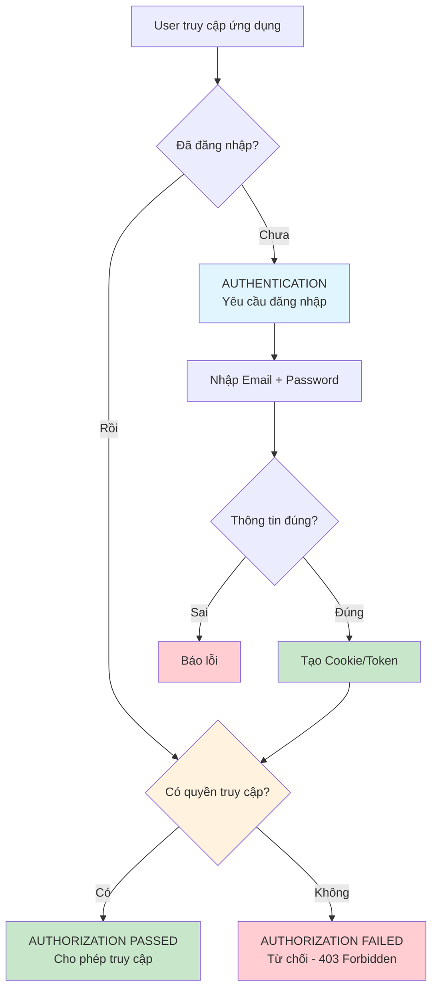
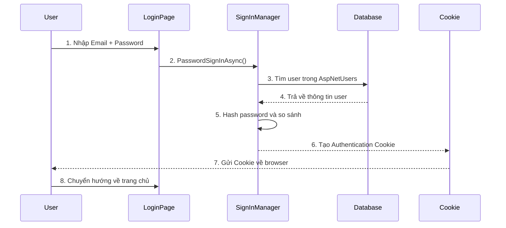
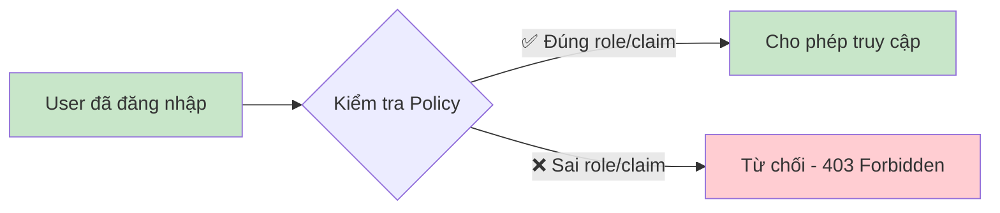

# BÁO CÁO LAB 1 - BÀI 3

## ASP.NET Core Identity - Scaffolding & Authentication vs Authorization

---

<div align="center">

**Học phần:** NET1051 - Lập trình C# 5  
**Tên bài:** Sử dụng Scaffolding để tạo giao diện xác thực  
**Sinh viên:** [Tên sinh viên]  
**MSSV:** [Mã số sinh viên]  
**Ngày thực hiện:** [Ngày/tháng/năm]

</div>

---

## MỤC LỤC

1. [Giới thiệu](#1-giới-thiệu)
2. [Chuẩn bị dự án](#2-chuẩn-bị-dự-án)
3. [Scaffolding Identity UI](#3-scaffolding-identity-ui)
4. [Phân biệt Authentication và Authorization](#4-phân-biệt-authentication-và-authorization)
5. [Chi tiết mã nguồn](#5-chi-tiết-mã-nguồn)
6. [Kiểm tra và chạy ứng dụng](#6-kiểm-tra-và-chạy-ứng-dụng)
7. [Kết luận](#7-kết-luận)

---

## 1. GIỚI THIỆU

Trong bài thực hành này, chúng ta sẽ học cách sử dụng **ASP.NET Core Identity Scaffolding** để tự động tạo ra các trang giao diện cho chức năng xác thực người dùng, bao gồm:

- **Register** (Đăng ký tài khoản)
- **Login** (Đăng nhập)
- **Logout** (Đăng xuất)

Scaffolding giúp chúng ta có thể tùy chỉnh giao diện và logic của các trang này thay vì sử dụng các trang mặc định được nhúng sẵn trong thư viện Identity.

Ngoài ra, bài thực hành cũng giúp sinh viên hiểu rõ sự khác biệt giữa hai khái niệm quan trọng trong bảo mật ứng dụng web:
- **Authentication** (Xác thực): "Bạn là ai?"
- **Authorization** (Phân quyền): "Bạn được làm gì?"

---

## 2. CHUẨN BỊ DỰ ÁN

### 2.1. Cấu trúc dự án

```
Bai3/
├── Areas/
│   └── Identity/
│       └── Pages/
│           └── Account/
│               ├── Login.cshtml
│               ├── Login.cshtml.cs
│               ├── Register.cshtml
│               ├── Register.cshtml.cs
│               ├── Logout.cshtml
│               └── Logout.cshtml.cs
├── Controllers/
│   └── HomeController.cs
├── Data/
│   └── ApplicationDbContext.cs
├── Models/
├── Views/
├── Program.cs
├── appsettings.json
└── Bai3.csproj
```

### 2.2. Các NuGet Packages cần thiết

Dự án cần cài đặt các gói sau:

```xml
<PackageReference Include="Microsoft.AspNetCore.Identity.EntityFrameworkCore" Version="9.0.0" />
<PackageReference Include="Microsoft.EntityFrameworkCore.SqlServer" Version="9.0.0" />
<PackageReference Include="Microsoft.EntityFrameworkCore.Tools" Version="9.0.0" />
<PackageReference Include="Microsoft.VisualStudio.Web.CodeGeneration.Design" Version="9.0.0" />
```

> **Giải thích:**
> - `Microsoft.AspNetCore.Identity.EntityFrameworkCore`: Thư viện Identity cho Entity Framework Core
> - `Microsoft.EntityFrameworkCore.SqlServer`: Provider để kết nối SQL Server
> - `Microsoft.EntityFrameworkCore.Tools`: Công cụ để chạy migrations
> - `Microsoft.VisualStudio.Web.CodeGeneration.Design`: Công cụ Scaffolding

### 2.3. Cấu hình Database

**File: `appsettings.json`**

```json
{
  "ConnectionStrings": {
    "DefaultConnection": "Server=(localdb)\\mssqllocaldb;Database=Bai3IdentityDB;Trusted_Connection=True;MultipleActiveResultSets=true"
  },
  "Logging": {
    "LogLevel": {
      "Default": "Information",
      "Microsoft.AspNetCore": "Warning"
    }
  },
  "AllowedHosts": "*"
}
```

---

## 3. SCAFFOLDING IDENTITY UI

### 3.1. Khái niệm Scaffolding

**Scaffolding** (tạm dịch: "Giàn giáo") là một kỹ thuật trong ASP.NET Core cho phép tự động tạo ra code mẫu (boilerplate code) cho các chức năng phổ biến. 

Trong trường hợp Identity, scaffolding sẽ:
- Tạo ra các file `.cshtml` (Razor Pages) chứa giao diện HTML
- Tạo ra các file `.cshtml.cs` (Page Models) chứa logic xử lý
- Cho phép lập trình viên tùy chỉnh hoàn toàn giao diện và logic

**Lợi ích:**
✅ Tiết kiệm thời gian viết code từ đầu  
✅ Có thể tùy chỉnh giao diện theo ý muốn  
✅ Hiểu rõ cách hoạt động của Identity  
✅ Dễ dàng bảo trì và mở rộng  

### 3.2. Các bước thực hiện Scaffolding

#### Bước 1: Cài đặt công cụ aspnet-codegenerator

```bash
dotnet tool install -g dotnet-aspnet-codegenerator
```

> **Lưu ý:** Chỉ cần cài đặt một lần trên máy tính. Nếu đã cài đặt, có thể bỏ qua bước này.

#### Bước 2: Chạy lệnh Scaffolding

Mở Terminal/Command Prompt tại thư mục dự án và chạy lệnh:

```bash
dotnet aspnet-codegenerator identity -dc Bai3.Data.ApplicationDbContext --files "Account.Register;Account.Login;Account.Logout"
```

**Giải thích các tham số:**

| Tham số | Ý nghĩa |
|---------|---------|
| `identity` | Chỉ định tạo scaffold cho Identity |
| `-dc Bai3.Data.ApplicationDbContext` | Chỉ định DbContext sử dụng |
| `--files` | Danh sách file cần tạo |
| `Account.Register` | Trang đăng ký |
| `Account.Login` | Trang đăng nhập |
| `Account.Logout` | Trang đăng xuất |

#### Bước 3: Kết quả sau khi Scaffolding

Sau khi chạy lệnh thành công, thư mục `Areas/Identity/Pages/Account/` sẽ được tạo ra với các file:

```
Areas/
└── Identity/
    └── Pages/
        ├── Account/
        │   ├── Login.cshtml          (Giao diện đăng nhập)
        │   ├── Login.cshtml.cs       (Logic đăng nhập)
        │   ├── Register.cshtml        (Giao diện đăng ký)
        │   ├── Register.cshtml.cs    (Logic đăng ký)
        │   ├── Logout.cshtml          (Giao diện đăng xuất)
        │   ├── Logout.cshtml.cs      (Logic đăng xuất)
        │   └── _ViewImports.cshtml
        ├── _ValidationScriptsPartial.cshtml
        ├── _ViewImports.cshtml
        └── _ViewStart.cshtml
```

---

## 4. PHÂN BIỆT AUTHENTICATION VÀ AUTHORIZATION

### 4.1. Biểu đồ so sánh



### 4.2. Authentication (Xác thực) - "Bạn là ai?"

#### Định nghĩa

**Authentication** (Xác thực) là quá trình kiểm tra và xác minh danh tính của người dùng để đảm bảo họ là người mà họ tuyên bố.

#### Cách hoạt động trong ASP.NET Core Identity



#### Ví dụ thực tế

🔐 **Tình huống:** Bạn muốn đăng nhập vào Gmail

1. **Bước 1:** Bạn nhập email: `student@fpt.edu.vn`
2. **Bước 2:** Bạn nhập mật khẩu: `MySecurePass123!`
3. **Bước 3:** Hệ thống Google kiểm tra trong database:
   - Email có tồn tại không? ✅
   - Mật khẩu có đúng không? ✅
4. **Bước 4:** Xác thực thành công → Bạn được đăng nhập

#### Code minh họa

**File: `Areas/Identity/Pages/Account/Login.cshtml.cs`**

```csharp
public async Task<IActionResult> OnPostAsync(string returnUrl = null)
{
    returnUrl ??= Url.Content("~/");

    if (ModelState.IsValid)
    {
        // AUTHENTICATION: Xác thực thông tin đăng nhập
        var result = await _signInManager.PasswordSignInAsync(
            Input.Email,           // Email của user
            Input.Password,        // Password đã nhập
            Input.RememberMe,      // Có nhớ đăng nhập không?
            lockoutOnFailure: false
        );

        if (result.Succeeded)
        {
            // ✅ Xác thực thành công - Tạo cookie
            _logger.LogInformation("User logged in.");
            return LocalRedirect(returnUrl);
        }
        else
        {
            // ❌ Xác thực thất bại
            ModelState.AddModelError(string.Empty, "Invalid login attempt.");
            return Page();
        }
    }

    return Page();
}
```

---

### 4.3. Authorization (Phân quyền) - "Bạn được làm gì?"

#### Định nghĩa

**Authorization** (Phân quyền) là quá trình kiểm tra xem người dùng **đã được xác thực** có quyền truy cập vào tài nguyên cụ thể hay không.

#### Cách hoạt động



#### Ví dụ thực tế

🏢 **Tình huống:** Hệ thống quản lý nhân sự công ty

Có 3 loại tài khoản:
1. **Admin** (Giám đốc)
2. **Manager** (Quản lý)
3. **Employee** (Nhân viên)

**Kịch bản:**

| Hành động | Admin | Manager | Employee |
|-----------|-------|---------|----------|
| Xem danh sách nhân viên | ✅ Được | ✅ Được | ❌ Không được |
| Sửa lương nhân viên | ✅ Được | ❌ Không được | ❌ Không được |
| Xóa tài khoản | ✅ Được | ❌ Không được | ❌ Không được |
| Xem thông tin cá nhân | ✅ Được | ✅ Được | ✅ Được |

#### Code minh họa

**Ví dụ 1: Yêu cầu đăng nhập (Authorization cơ bản)**

```csharp
using Microsoft.AspNetCore.Authorization;
using Microsoft.AspNetCore.Mvc;

public class SecureController : Controller
{
    // Phải đăng nhập mới vào được
    [Authorize]
    public IActionResult Dashboard()
    {
        return View();
    }
}
```

---

### 4.4. Bảng so sánh chi tiết

| Tiêu chí | Authentication (Xác thực) | Authorization (Phân quyền) |
|----------|---------------------------|----------------------------|
| **Câu hỏi** | "Bạn là ai?" | "Bạn được làm gì?" |
| **Mục đích** | Xác minh danh tính | Kiểm tra quyền truy cập |
| **Thời điểm** | Trước khi vào hệ thống | Sau khi đã vào hệ thống |
| **Phương thức** | Đăng nhập bằng Email + Password | Kiểm tra Role, Claims, Policy |
| **Công cụ trong Identity** | `SignInManager`<br/>`PasswordSignInAsync()` | `[Authorize]` attribute<br/>`Policy`, `Roles` |
| **Kết quả thành công** | Tạo Cookie/Token | Cho phép truy cập tài nguyên |
| **Kết quả thất bại** | Không đăng nhập được | 403 Forbidden |
| **Ví dụ** | Đăng nhập Gmail | Admin xem báo cáo, User không xem được |
| **Bảng liên quan** | `AspNetUsers`<br/>`AspNetUserClaims` | `AspNetRoles`<br/>`AspNetUserRoles`<br/>`AspNetRoleClaims` |

---

## 5. CHI TIẾT MÃ NGUỒN

### 5.1. ApplicationDbContext.cs

```csharp
using Microsoft.AspNetCore.Identity;
using Microsoft.AspNetCore.Identity.EntityFrameworkCore;
using Microsoft.EntityFrameworkCore;

namespace Bai3.Data;

public class ApplicationDbContext : IdentityDbContext<IdentityUser>
{
    public ApplicationDbContext(DbContextOptions<ApplicationDbContext> options)
        : base(options)
    {
    }
}
```

**Giải thích:**
- Kế thừa `IdentityDbContext<IdentityUser>` để có sẵn 7 bảng Identity
- Sử dụng `IdentityUser` mặc định (có thể tùy chỉnh bằng cách tạo class kế thừa)

---

### 5.2. Program.cs

```csharp
using Bai3.Data;
using Microsoft.AspNetCore.Identity;
using Microsoft.EntityFrameworkCore;

var builder = WebApplication.CreateBuilder(args);

// ========== CẤU HÌNH DATABASE ==========
// Lấy connection string từ appsettings.json
var connectionString = builder.Configuration.GetConnectionString("DefaultConnection") 
    ?? throw new InvalidOperationException("Connection string 'DefaultConnection' not found.");

// Đăng ký DbContext với SQL Server
builder.Services.AddDbContext<ApplicationDbContext>(options =>
    options.UseSqlServer(connectionString));

// ========== CẤU HÌNH IDENTITY ==========
builder.Services.AddDefaultIdentity<IdentityUser>(options => 
{
    // Không yêu cầu xác nhận email (cho mục đích demo)
    options.SignIn.RequireConfirmedAccount = false;
    
    // Cấu hình password (có thể tùy chỉnh)
    options.Password.RequireDigit = true;
    options.Password.RequiredLength = 6;
    options.Password.RequireNonAlphanumeric = false;
    options.Password.RequireUppercase = true;
    options.Password.RequireLowercase = false;
})
.AddEntityFrameworkStores<ApplicationDbContext>();

// Thêm MVC
builder.Services.AddControllersWithViews();

var app = builder.Build();

// ========== MIDDLEWARE PIPELINE ==========
if (!app.Environment.IsDevelopment())
{
    app.UseExceptionHandler("/Home/Error");
    app.UseHsts();
}

app.UseHttpsRedirection();
app.UseRouting();

// ⚠️ QUAN TRỌNG: Thứ tự phải đúng
app.UseAuthentication();  // Authentication phải đứng TRƯỚC Authorization
app.UseAuthorization();

app.MapStaticAssets();

app.MapControllerRoute(
    name: "default",
    pattern: "{controller=Home}/{action=Index}/{id?}")
    .WithStaticAssets();

app.Run();
```

---

## 6. KIỂM TRA VÀ CHẠY ỨNG DỤNG

1. Chạy lệnh: `dotnet run`
2. Mở trình duyệt: `https://localhost:7165` (hoặc port tương ứng)
3. Thử nghiệm:
   - Click **Register** để tạo tài khoản mới.
   - Click **Logout** để đăng xuất.
   - Click **Login** để đăng nhập lại.
   - Kiểm tra database để thấy user đã được tạo.

---

## 7. KẾT LUẬN

Qua bài lab này, chúng ta đã:
1. Biết cách sử dụng `Scaffolding` để tạo nhanh giao diện Identity.
2. Hiểu rõ quy trình xác thực (`Authentication`) và phân quyền (`Authorization`).
3. Tùy chỉnh code Identity.
